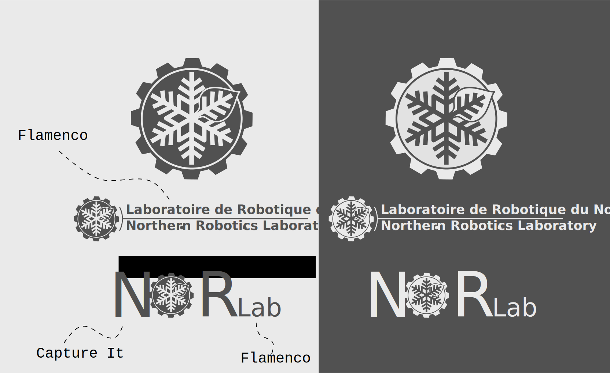

# Visual Identity of Norlab

This is the visual identity of [Norlab](https://norlab-ulaval.github.io/) including logos, colors and fonts. 
The versions `norlab_logo_stamp*`, `norlab_logo_acronym*`, `norlab_logo_text*` should be used for your publications.

## Stamp (monocolor)

## Acronym

## Full Text

## Source

The following figure is the source with text fields. If the fonts don't render as usual, it's because the fonts are not installed on your system.

## Colors

- Light gray: #eaeaeaff
- Dark gray: #515151ff

## Fonts

- Capture It by Magique Fonts 
- Flamenco by LatinoType 

## Formats

- Latex: pdf
- Website: svg

