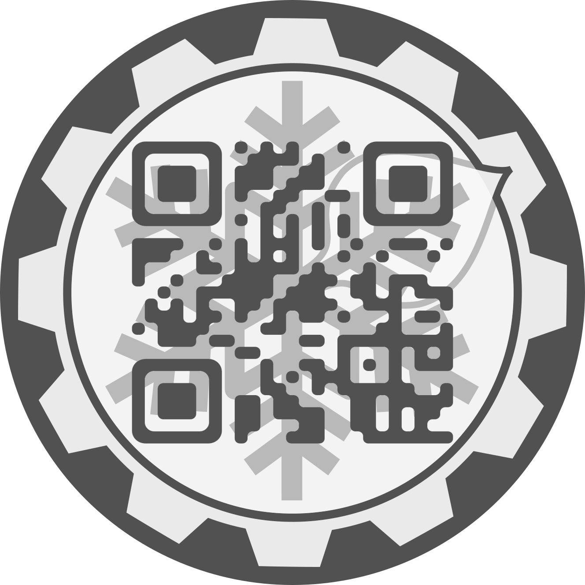

To replicate the look of the generated stickers, use this [tool](https://www.the-qrcode-generator.com/) to generate QR codes.
Select `Smooth` in _Style_ and set the pixel and square color to `#515151`.
Finally, minimize the Outer margin parameter.

Happy QR-coding!

